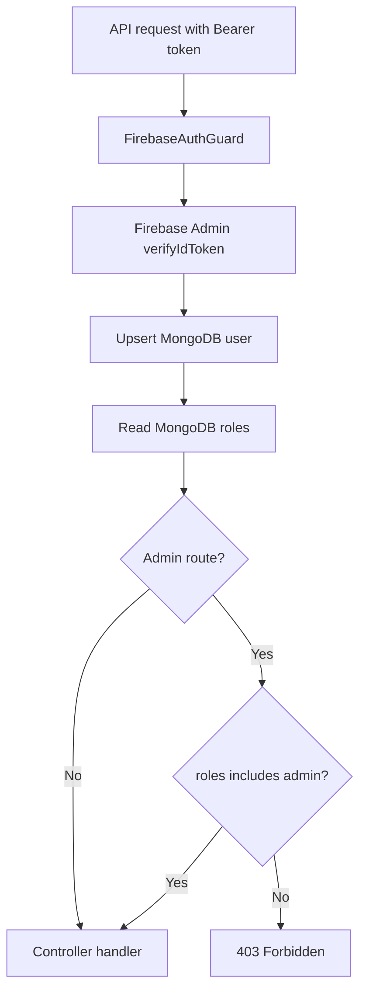

# Auth RBAC Flow

```mermaid
flowchart TD
  Request["API request with Bearer token"] --> Guard["FirebaseAuthGuard"]
  Guard --> Verify["Firebase Admin verifyIdToken"]
  Verify --> Upsert["Upsert MongoDB user"]
  Upsert --> Roles["Read MongoDB roles"]
  Roles --> IsAdmin{"Admin route?"}
  IsAdmin -- No --> Handler["Controller handler"]
  IsAdmin -- Yes --> CheckAdmin{"roles includes admin?"}
  CheckAdmin -- Yes --> Handler
  CheckAdmin -- No --> Forbidden["403 Forbidden"]
```
