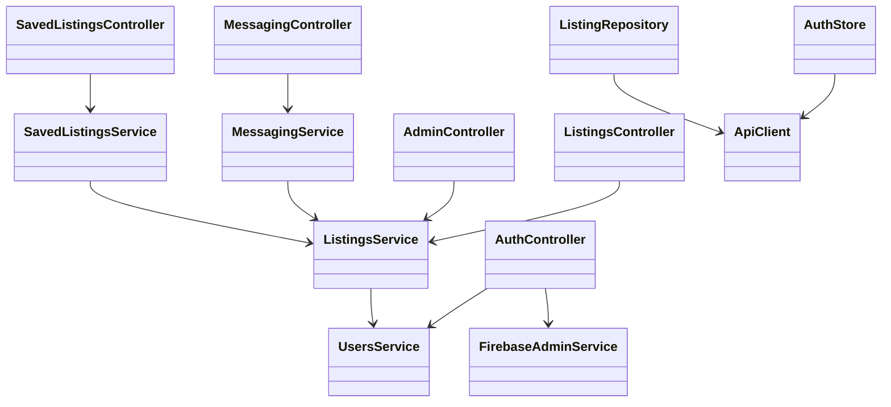

# Class Diagram

```mermaid
classDiagram
  class AuthController
  class UsersService
  class FirebaseAdminService
  class ListingsController
  class ListingsService
  class AdminController
  class MessagingController
  class MessagingService
  class SavedListingsController
  class SavedListingsService
  class ApiClient
  class AuthStore
  class ListingRepository

  AuthController --> UsersService
  AuthController --> FirebaseAdminService
  ListingsController --> ListingsService
  ListingsService --> UsersService
  AdminController --> ListingsService
  MessagingController --> MessagingService
  MessagingService --> ListingsService
  SavedListingsController --> SavedListingsService
  SavedListingsService --> ListingsService
  AuthStore --> ApiClient
  ListingRepository --> ApiClient
```
