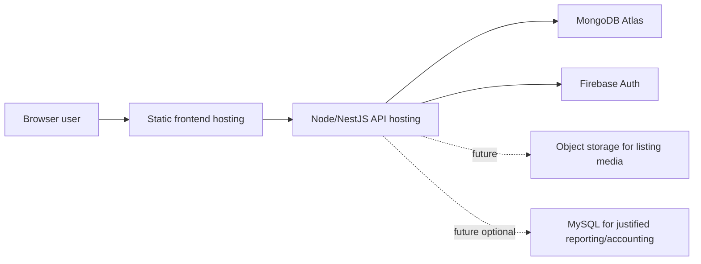

# Deployment View

```mermaid
flowchart LR
  User["Browser user"] --> CDN["Static frontend hosting"]
  CDN --> API["Node/NestJS API hosting"]
  API --> Mongo["MongoDB Atlas"]
  API --> FirebaseAuth["Firebase Auth"]
  API -. future .-> Storage["Object storage for listing media"]
  API -. future optional .-> MySQL["MySQL for justified reporting/accounting"]
```
