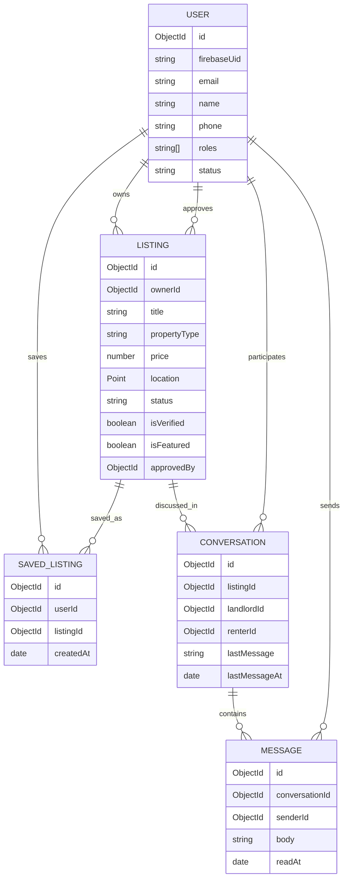

# ER Diagram

```mermaid
erDiagram
  USER ||--o{ LISTING : owns
  USER ||--o{ SAVED_LISTING : saves
  LISTING ||--o{ SAVED_LISTING : saved_as
  LISTING ||--o{ CONVERSATION : discussed_in
  USER ||--o{ CONVERSATION : participates
  CONVERSATION ||--o{ MESSAGE : contains
  USER ||--o{ MESSAGE : sends
  USER ||--o{ LISTING : approves

  USER {
    ObjectId id
    string firebaseUid
    string email
    string name
    string phone
    string[] roles
    string status
  }

  LISTING {
    ObjectId id
    ObjectId ownerId
    string title
    string propertyType
    number price
    Point location
    string status
    boolean isVerified
    boolean isFeatured
    ObjectId approvedBy
  }

  CONVERSATION {
    ObjectId id
    ObjectId listingId
    ObjectId landlordId
    ObjectId renterId
    string lastMessage
    date lastMessageAt
  }

  MESSAGE {
    ObjectId id
    ObjectId conversationId
    ObjectId senderId
    string body
    date readAt
  }

  SAVED_LISTING {
    ObjectId id
    ObjectId userId
    ObjectId listingId
    date createdAt
  }
```
