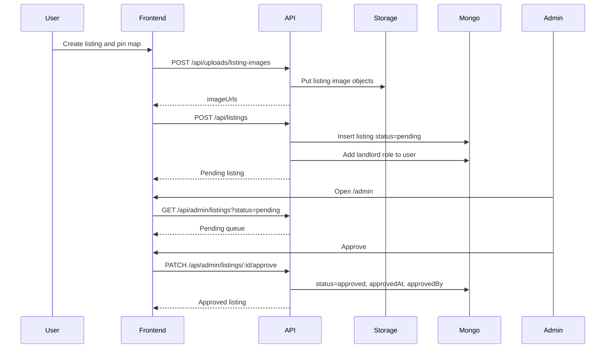

# Listing Approval Sequence

```mermaid
sequenceDiagram
  participant User
  participant Frontend
  participant API
  participant Storage
  participant Mongo
  participant Admin

  User->>Frontend: Create listing and pin map
  Frontend->>API: POST /api/uploads/listing-images
  API->>Storage: Put listing image objects
  API-->>Frontend: imageUrls
  Frontend->>API: POST /api/listings
  API->>Mongo: Insert listing status=pending
  API->>Mongo: Add landlord role to user
  API-->>Frontend: Pending listing
  Admin->>Frontend: Open /admin
  Frontend->>API: GET /api/admin/listings?status=pending
  API-->>Frontend: Pending queue
  Admin->>Frontend: Approve
  Frontend->>API: PATCH /api/admin/listings/:id/approve
  API->>Mongo: status=approved, approvedAt, approvedBy
  API-->>Frontend: Approved listing
```
