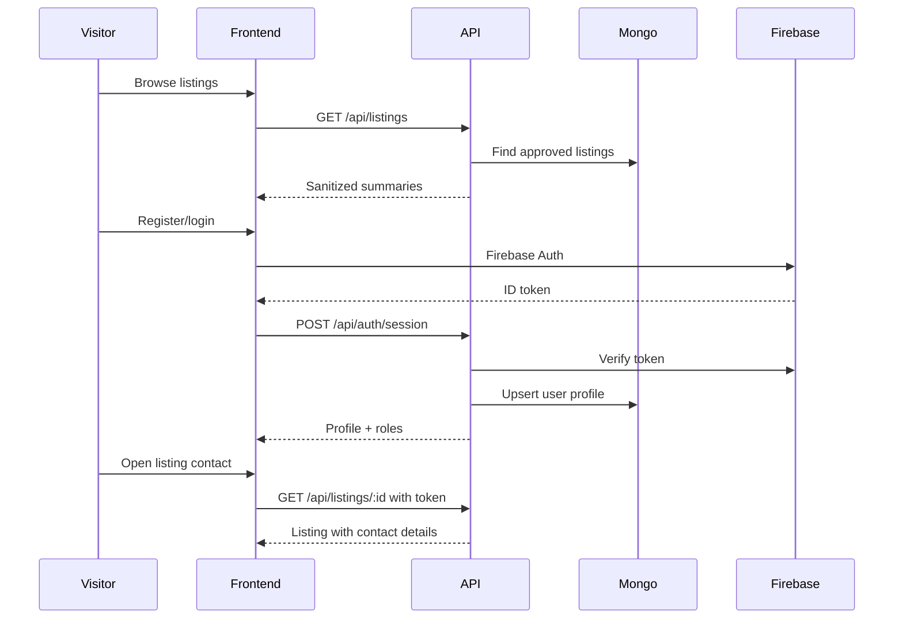

# Main User Sequence

```mermaid
sequenceDiagram
  participant Visitor
  participant Frontend
  participant API
  participant Mongo
  participant Firebase

  Visitor->>Frontend: Browse listings
  Frontend->>API: GET /api/listings
  API->>Mongo: Find approved listings
  API-->>Frontend: Sanitized summaries
  Visitor->>Frontend: Register/login
  Frontend->>Firebase: Firebase Auth
  Firebase-->>Frontend: ID token
  Frontend->>API: POST /api/auth/session
  API->>Firebase: Verify token
  API->>Mongo: Upsert user profile
  API-->>Frontend: Profile + roles
  Visitor->>Frontend: Open listing contact
  Frontend->>API: GET /api/listings/:id with token
  API-->>Frontend: Listing with contact details
```
