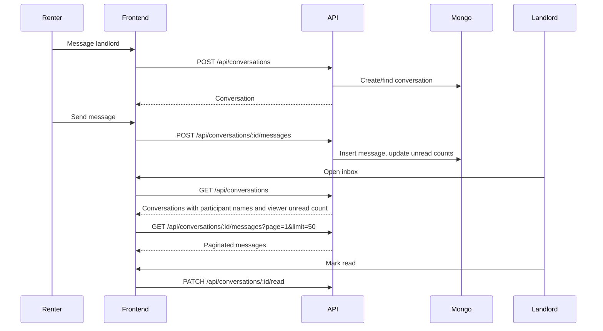

# Messaging Sequence

```mermaid
sequenceDiagram
  participant Renter
  participant Frontend
  participant API
  participant Mongo
  participant Landlord

  Renter->>Frontend: Message landlord
  Frontend->>API: POST /api/conversations
  API->>Mongo: Create/find conversation
  API-->>Frontend: Conversation
  Renter->>Frontend: Send message
  Frontend->>API: POST /api/conversations/:id/messages
  API->>Mongo: Insert message, update unread counts
  Landlord->>Frontend: Open inbox
  Frontend->>API: GET /api/conversations
  API-->>Frontend: Conversations with participant names and viewer unread count
  Frontend->>API: GET /api/conversations/:id/messages?page=1&limit=50
  API-->>Frontend: Paginated messages
  Landlord->>Frontend: Mark read
  Frontend->>API: PATCH /api/conversations/:id/read
```
