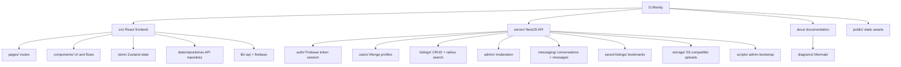

# Project Tree

```mermaid
graph TD
  Repo["D:/Rently"]
  Repo --> Frontend["src/ React frontend"]
  Repo --> Server["server/ NestJS API"]
  Repo --> Docs["docs/ documentation"]
  Repo --> Public["public/ static assets"]

  Frontend --> Pages["pages/ routes"]
  Frontend --> Components["components/ UI and flows"]
  Frontend --> Stores["store/ Zustand state"]
  Frontend --> Data["data/repositories API repository"]
  Frontend --> Lib["lib/ api + firebase"]

  Server --> Auth["auth/ Firebase token session"]
  Server --> Users["users/ Mongo profiles"]
  Server --> Listings["listings/ CRUD + radius search"]
  Server --> Admin["admin/ moderation"]
  Server --> Messaging["messaging/ conversations + messages"]
  Server --> Saved["saved-listings/ bookmarks"]
  Server --> Storage["storage/ S3-compatible uploads"]
  Server --> Scripts["scripts/ admin bootstrap"]

  Docs --> Diagrams["diagrams/ Mermaid"]
```
