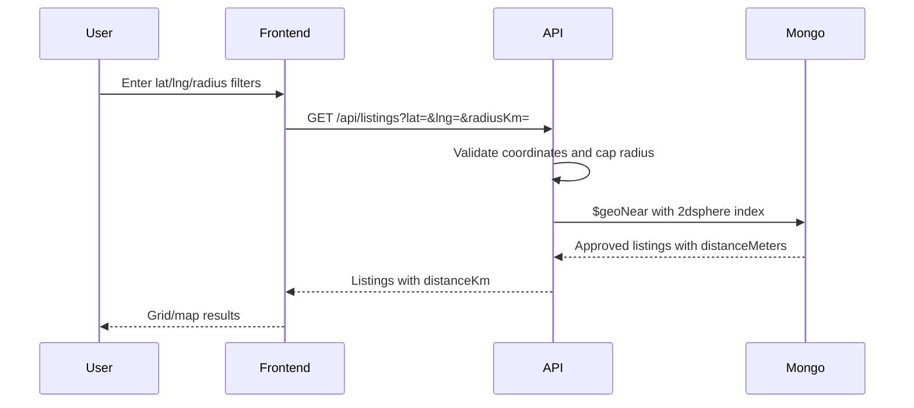

# Radius Search Flow

```mermaid
sequenceDiagram
  participant User
  participant Frontend
  participant API
  participant Mongo

  User->>Frontend: Enter lat/lng/radius filters
  Frontend->>API: GET /api/listings?lat=&lng=&radiusKm=
  API->>API: Validate coordinates and cap radius
  API->>Mongo: $geoNear with 2dsphere index
  Mongo-->>API: Approved listings with distanceMeters
  API-->>Frontend: Listings with distanceKm
  Frontend-->>User: Grid/map results
```
