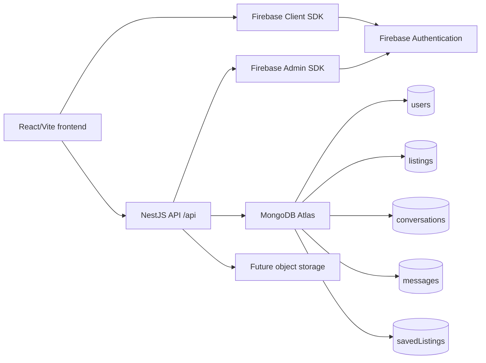

# System Architecture

```mermaid
flowchart LR
  Browser["React/Vite frontend"] --> FirebaseClient["Firebase Client SDK"]
  FirebaseClient --> FirebaseAuth["Firebase Authentication"]
  Browser --> API["NestJS API /api"]
  API --> FirebaseAdmin["Firebase Admin SDK"]
  FirebaseAdmin --> FirebaseAuth
  API --> Mongo["MongoDB Atlas"]
  Mongo --> Users[(users)]
  Mongo --> Listings[(listings)]
  Mongo --> Conversations[(conversations)]
  Mongo --> Messages[(messages)]
  Mongo --> Saved[(savedListings)]
  API --> FutureStorage["Future object storage"]
```
